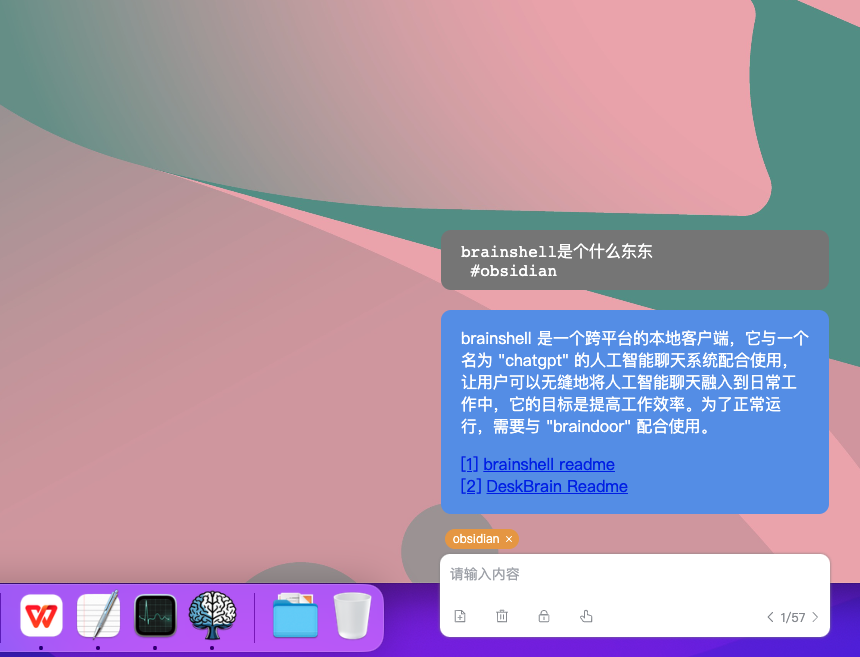

# Brainshell

Brainshell是一个chatgpt的跨平台本地客户端，特点是无框模式，目标是把和AI聊天融合到日常工作中。需要和braindoor配合才能正常运行。    
"Brainshell" is a cross-platform local client for "chatgpt" that features a frameless mode. Its goal is to integrate AI chat into daily work, and it requires coordination with "braindoor" to operate properly.    
    
    
这个仓库只作为代码托管，下载打包好的版本访问： https://github.com/newfyu/DeskBrain    
This repository is only used as code hosting, and can be accessed by downloading the packaged version: https://github.com/newfyu/DeskBrain      



## Project setup
```
yarn install
```

### Compiles and hot-reloads for development
```
yarn electron:serve
```

### Compiles and minifies for production
```
yarn electron:build
```
